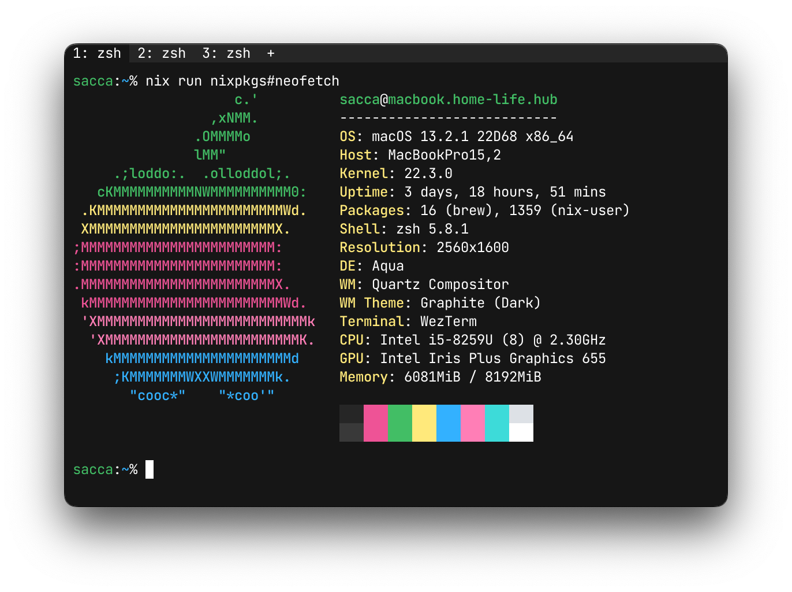
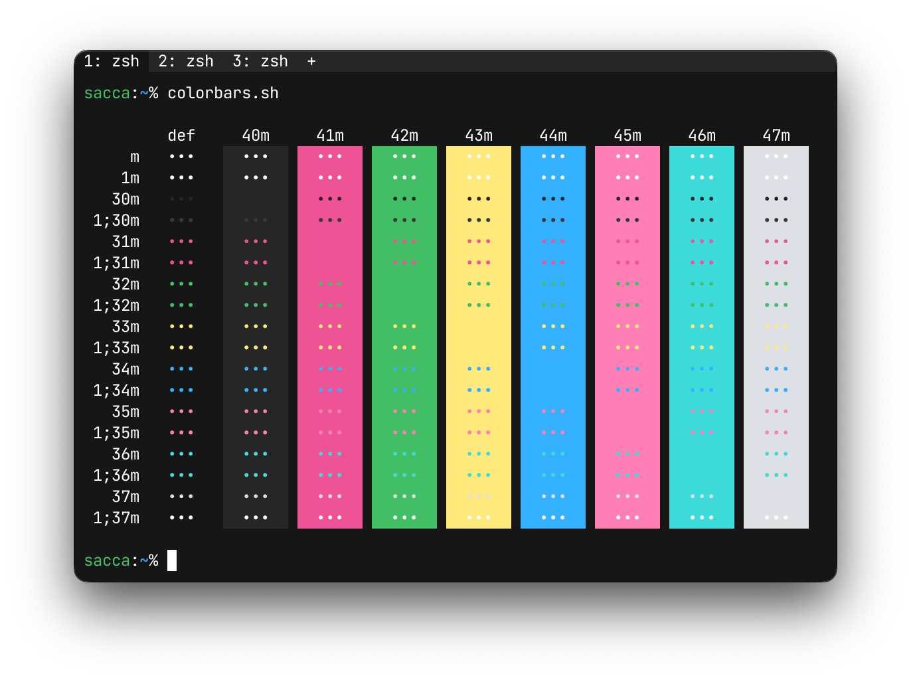

<div align="center">

# oxocarbon-wezterm

</div>

<div align="center">

[](https://github.com/nyoom-engineering/oxocarbon/stargazers)
[](https://github.com/nyoom-engineering/oxocarbon/issues)
[](https://mit-license.org/)


</div>

Oxocarbon is a set of community ports of IBM's carbon color palette and design philosophy to various applications and tooling.

## Showcase




## Install

1. Run the following commands:

```bash
mkdir -p $HOME/.config/wezterm/colors
cd $HOME/.config/wezterm/colors/
curl -O https://raw.githubusercontent.com/nyoom-engineering/oxocarbon-wezterm/main/oxocarbon-dark.toml
```

2. Set it up as your colorscheme in your `wezterm.lua`

```lua
return {
  color_scheme = 'Oxocarbon Dark',
  use_fancy_tab_bar = false,
}
```

3. (optional) for a better experience consider enable this settings:

```lua
return {
  window_decorations = "RESIZE",
  hide_tab_bar_if_only_one_tab = true,
}
```

## License

The project is licensed under the MIT license
